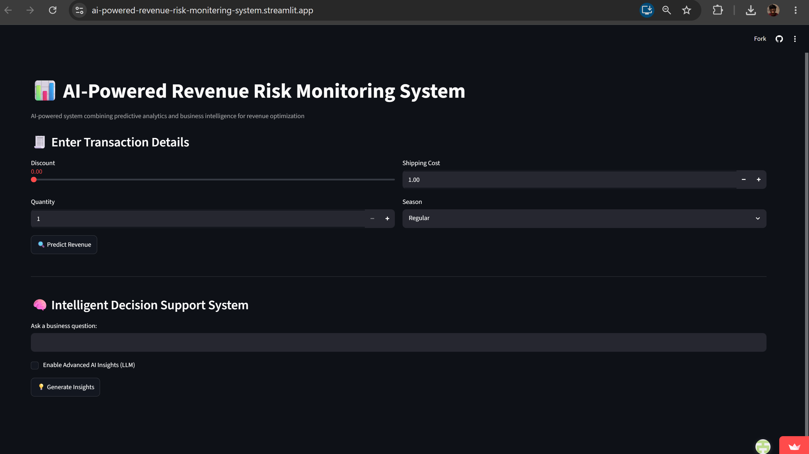
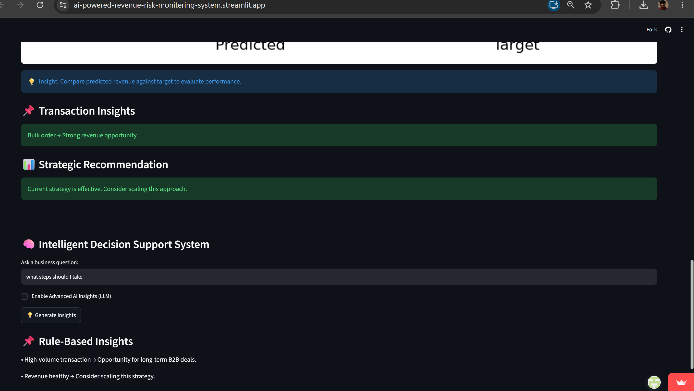

# 📊 AI-Powered Revenue Risk Monitoring System

An interactive business decision support system that predicts transaction revenue using machine learning and helps identify potential revenue risks through business intelligence. The application combines predictive analytics, business rules, and an optional LLM-assisted insights layer within a Streamlit dashboard.

🔗 **Live Demo:** [https://ai-powered-revenue-risk-monitering-system.streamlit.app/]

📄 **Detailed Project Report:** [https://drive.google.com/file/d/1HLlSdNCCW6JUh9OuSV3-tsbBqRHYWh1A/view]

---

## Business Problem

Organizations often struggle to identify transactions that negatively impact revenue due to pricing strategies, order volume, and operational costs. Manually analyzing these factors can be time-consuming and inconsistent.

This project provides an interactive system that predicts revenue, evaluates transaction risk, and generates business-oriented recommendations to support data-driven decision making.

---

## Key Features

* 📈 Revenue prediction using a Machine Learning regression model
* ⚠️ Revenue risk assessment with business-oriented recommendations
* 📊 Interactive KPI dashboard for business monitoring
* 📉 Revenue vs. Target visualization
* 📌 Rule-based business decision engine
* 🤖 Optional LLM-assisted insights (fallback to rule-based recommendations when unavailable)
* 🌐 Interactive Streamlit web application

---

## Technology Stack

* Python
* Pandas
* NumPy
* Scikit-learn
* Matplotlib
* Streamlit
* OpenAI API (optional LLM integration)

---

## High-Level Workflow

```text
User Input
     │
     ▼
Feature Processing
     │
     ▼
Machine Learning Model
     │
     ▼
Revenue Prediction
     │
     ▼
Risk Assessment
     │
     ▼
Business Insights
     │
     ├── Rule-Based Decision Engine
     └── Optional LLM Assistance
```

---

## Model Performance

| Metric                    |             Value |
| ------------------------- | ----------------: |
| Model                     | Linear Regression |
| R² Score                  |             ~0.52 |
| Mean Absolute Error (MAE) |              ~580 |

---

## Business Value

The application helps users:

* Detect potentially high-risk transactions
* Monitor revenue performance
* Understand the business impact of discounts and operational costs
* Support pricing and operational decision-making through actionable recommendations

---

## 📸 Screenshots

| Dashboard | Prediction & Risk Analysis |
|-----------|----------------------------|
|  |  |

| Business Insights |
|-------------------|
|  |

---

## Installation

```bash
git clone https://github.com/Sujith930/AI-Powered-Revenue-Risk-Monitoring-System.git

cd AI-Powered-Revenue-Risk-Monitoring-System

pip install -r requirements.txt
```

---

## Run the Application

```bash
streamlit run app.py
```

---

## Repository Structure

```text
.
├── app.py
├── requirements.txt
├── revenue_model.pkl
├── README.md
├── Project_Report.pdf
└── assets/
```

---

## Detailed Project Report

The complete project report contains:

* Problem formulation
* Dataset overview
* Methodology
* Feature engineering
* Model development
* System architecture
* Business analysis
* Implementation details
* Results
* Future improvements

For the complete documentation, refer to:

**📄 Project_Report.pdf**

---

## Future Improvements

* Compare multiple regression algorithms
* Integrate real-time business data
* Expand LLM capabilities for richer recommendations
* Improve dashboard interactivity and visual analytics
* Add automated testing and CI/CD pipeline

---

## License

This project is licensed under the MIT License.

---

## Author

**Sujith Kodakandla**

If you found this project useful, consider exploring the detailed project report for the complete methodology and implementation details.
